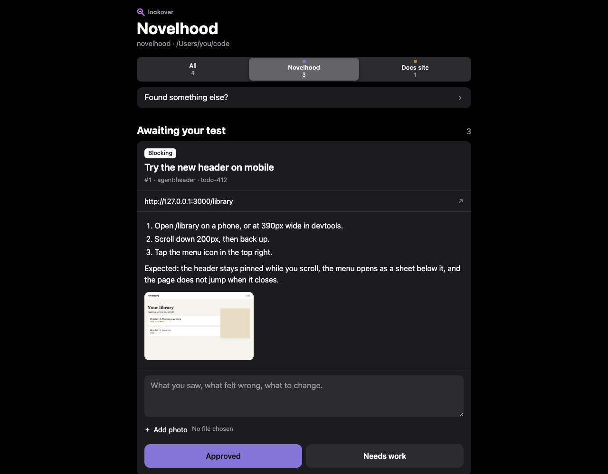
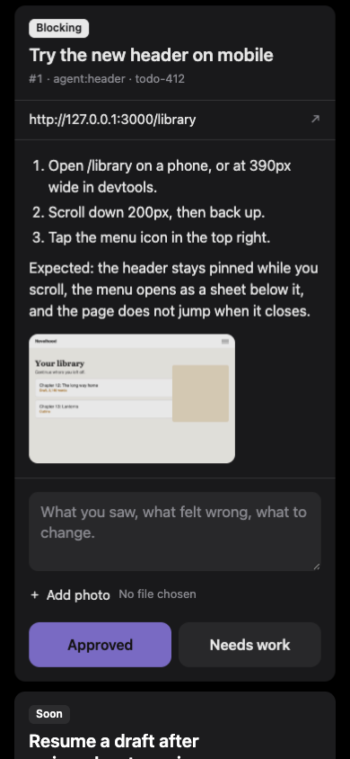
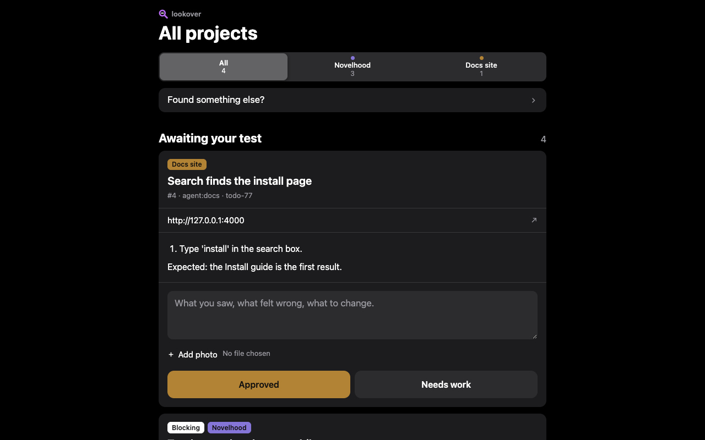

<p align="center"></p>
<p align="center"><a href="https://www.npmjs.com/package/@cmgmyr/lookover"></a> <a href="https://github.com/cmgmyr/lookover/actions/workflows/ci.yml"></a></p>

# Lookover

A manual-testing queue for an agent crew and one human tester.

Agents file cards with exact steps. You try each one and answer with a verdict and a paragraph. It is not a bug tracker, and it has no login or user accounts.

Lookover runs on your machine next to the app under test. The server listens on loopback by default. A `--local` store belongs to one project. The all-projects inbox is a feature of the global store.



## What it looks like

<p align="center"></p>

A project queue puts the cards to test first, each with its steps, its ref, the URL to open, and the answer form.

<table>
  <tr>
    <td align="center" width="260"><br>A card on your phone.</td>
    <td align="center"><br>The inbox across every project.</td>
  </tr>
</table>

## Install

You need Node 22.18 or newer. The package ships plain JavaScript; Node 22.18 provides the built-in sqlite support and runs the repo's TypeScript tests directly. Lookover has zero native dependencies and no runtime dependency install beyond Node itself.

Install it globally for daily use:

```sh
npm install --global @cmgmyr/lookover
```

Or run it without a global install:

```sh
npx @cmgmyr/lookover serve
```

## Quick start

Register your project once, from its directory. The default store lives at `~/.config/lookover`.

```sh
lookover init --name "My App" --url "http://127.0.0.1:3000"
```

File a card. Put the exact steps in a file, so they can run over several lines.

```sh
lookover add --title "Try the new header" --details-file steps.md --url "http://127.0.0.1:3000" --ref "todo-123"
```

Start the page, open <http://127.0.0.1:8123>, and answer the card with Approved or Needs work.

```sh
lookover serve
```

Then, in a second terminal, read the answer as the agent. Use the card id that `feedback --json` prints, and mark it handled with a note that names the work.

```sh
lookover feedback --json
lookover process 1 --note "todo-123: fixed the mobile header spacing"
```

## How the loop works

1. The agent files a card when a change lands, with exact steps, the expected result, the URL to open, and a ref for the work.
2. You test the card on the page and answer with a verdict and a paragraph.
3. The agent sweeps `lookover feedback --json`, acts on the answer, and processes the card with a note naming the work item.

The state is open while the tester has not answered, feedback while an answer waits for the agent, and processed after the agent records a note. A needs-work answer gets a new card after the fix. Link it to the old card with `--retest-of`.

## The queue

The default store lives at `~/.config/lookover`. Set `LOOKOVER_HOME` to use another global store, or pass `--local` to put `.lookover` in the project.

```sh
lookover open --count
lookover list --json
```

An add card should include the exact steps, expected result, URL to open, and ref for the work that produced it. Use `--details` for a short body or `--details-file` for multiline steps. Use `--source`, `--project`, `--sort`, and `--retest-of` when they add useful context.

Use `lookover project list [--all]` to inspect registered projects and `lookover project archive <slug>` to hide one. Add `--all` to `open`, `feedback`, or `list` to span every non-archived project.

### Import from a novelhood queue

Import a novelhood testing queue with `lookover import --from testing.sqlite --images images/ --project <slug>`. The command preserves legacy timestamps, reports unreferenced images, supports `--dry-run`, and refuses to import into a project that already has cards.

## The page

Start the built-in page with `lookover serve`. It uses the same store as the CLI and defaults to `127.0.0.1:8123`; starting another serve on the same port replaces the previous one, or use `--no-replace` to refuse it. When started inside a registered project, the root opens that project; otherwise it redirects to `/all` when several projects exist and to `/p/<slug>` when one project exists. `/all` shows every non-archived project. `/p/<slug>` shows one project. The project picker switches between those views, and `/api/counts?project=<slug>` or `/api/counts?project=all` returns open, feedback, and processed counts.

The page has Found something else, Awaiting your test, Waiting for the agent, and Processed. Found something else, Processed, and a waiting card's edit controls start collapsed, so the cards to test are what you see first. Cards show their title, source, ref, URL, body, images, verdict, and feedback form, with Approved and Needs work buttons submitting the answer directly. Note is still a stored verdict: cards you file yourself carry it.

You can paste screenshots straight into a card, and the page previews them before saving. With script on, every save posts in the background: the answered card settles in place, the form you filed from clears, and a toast confirms it, so a save never moves you; with script off, a save redirects back to its card. The page polls `/api/counts` every 30 seconds and can show a reload notice when new cards arrive.

The server binds to loopback unless you choose another host. `--host 0.0.0.0` exposes an upload endpoint on the Wi-Fi and requires `--token <x>`; requests without the token are rejected. There is no login, account system, or HTTPS layer.

## For agents

The package ships a skill at `skills/lookover/SKILL.md`. It gives an agent the same loop: file a card when a change lands, sweep `lookover feedback --json` at session start, then process the answer with a note naming the work item. Hive can carry the open count in a board pad line, but Hive is not required.

Install the agent skill into the directory used by Codex and Claude Code:

```sh
lookover skill install
```

Use `lookover skill install --to claude` for `~/.claude/skills/lookover`, or `lookover skill install --to project` for `.claude/skills/lookover` under the current git project. `lookover skill path` prints the package's skill directory. The installer creates a symlink to the package copy, so the skill and CLI stay together.

## Uploads

Attach images to a card with `lookover add --image shot.png`. Repeat the flag for more, up to 5. The card shows them as a strip of thumbnails after its body, and a tap opens the full file. The tester attaches photos to a verdict, or to a card they file themselves, with the Add photo picker on the page. On a phone the picker offers the camera.

Lookover accepts PNG, JPEG, WebP, and GIF, and checks the file's first bytes rather than its name or declared type. Each file can be up to 10 MB and each request can carry 5 files. Go over either limit, or send another type, and the whole request is refused and nothing is stored. HEIC is refused with a hint to pick JPEG in the camera settings or share the photo as JPEG.

JPEG uploads lose their Exif and APP13 (IPTC) segments, which is where GPS position and camera details live. The one thing kept is the orientation tag, so a portrait phone photo still opens upright. Nothing is re-encoded. Other formats are stored as sent. Thumbnails are the full file sized by CSS, so a large phone photo still downloads at full size.

Files live under `files/<project>/<card>/` in the store, and `list`, `open`, and `feedback` include each card's files in `--json` with an absolute path, so an agent can open the tester's photo.

## License

MIT. See [LICENSE](LICENSE).
